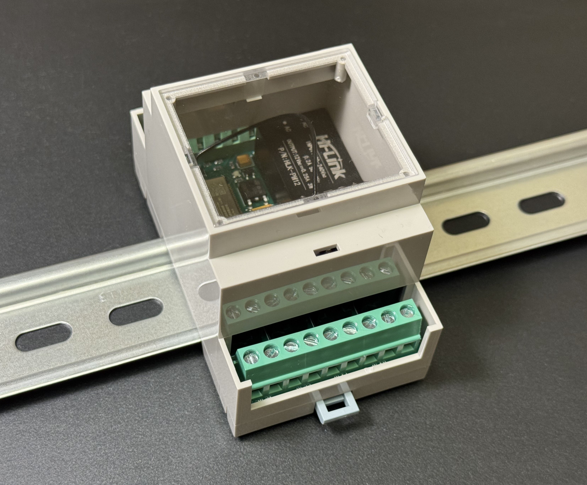
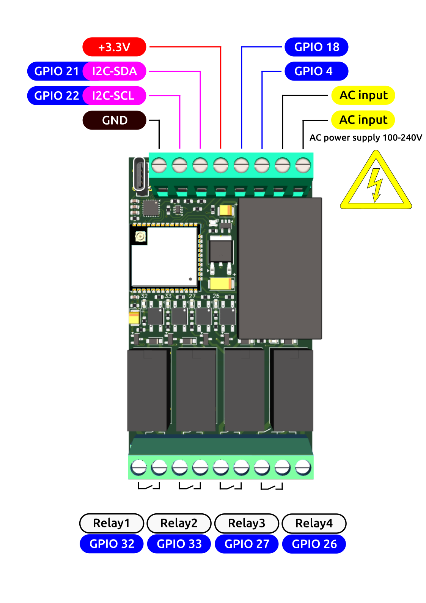

# ESP32-BOX

The device has been designed around regular ESP32-module to be fitted inside DIN-rail mounting enclosure. The board designed to be compact as much as possible. It takes 3 DIN-rail positions only.

### Main features:

- The **ESP32-BOX** has internal AC/DC-converter. Thus it could be powered from the regular AC line (i.e. wall socket) 100-240V (no external AC/DC adapters needed);
- The **ESP32-BOX** provides 4 optically isolated Relay outputs (up to 10A/250V or 5A/30V each). Each relay output has its own LED-indicator.
- The **ESP32-BOX** provides 4 GPIOs. Two of them could be used as I2C-line.
- All the inputs and outputs of the **ESP32-BOX** are implemented as reliable screw terminals.
- The **ESP32-BOX** has onboard RGB-led, which could be used for multiple status indications on your taste.
- The top part of the enclosure is transparent. So the LEDs could be easily observed from the outside.
- The **ESP32-BOX** provides powerful external antenna, which is located inside the enclosure. Thanks to `uFL/IPEX1` header any other suitable antenna could be used instead.
- The **ESP32-BOX** is equipped with the external +3dBi antenna hidden inside the enclosure;
- The **ESP32-BOX** could be programmed with the USB Type-C cable (no buttons required).
- The **ESP32-BOX** could be programmed with the ; write your sketches whenever you want: Arduino, CircuitPython, MicroPython or ESP-IDF.
- Finally, **ESP32-BOX** is **ESPHome**-compatible!

------

### Programming:

A number of different IDEs and programming languages of any taste as below are allowed to program the **ESP32-BOX**:

[ESPHome](https://www.binarytechlabs.com/how-to-flash-esphome-firmware-a-friendly-step-by-step-guide/)

[Arduino](https://randomnerdtutorials.com/installing-the-esp32-board-in-arduino-ide-windows-instructions/)

[CircuitPython](https://circuitpython.org/board/espressif_esp32_devkitc_v4_wroom_32e/)

[MicroPython](https://micropython.org/download/ESP32_GENERIC/)

[ESP-IDF](https://docs.espressif.com/projects/esp-idf/en/stable/esp32/get-started/index.html)

A couple of different examples could be found in the [FIRMWARE](FIRMWARE/) folder.

------

### Pinout:

------

Coming soon at Lectronz.com