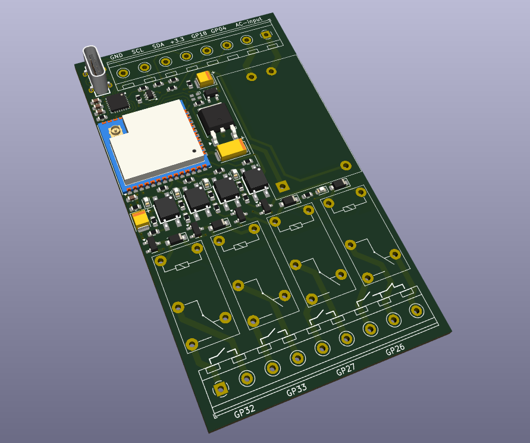

# ESP32-BOX

The device has been designed around regular ESP32-module to be fitted inside DIN-rail mounting enclosure. The board designed to be compact as much as possible. It takes 2 DIN-rail positions only.

### Main features:

- The **ESP32-BOX** has internal AC/DC-converter. Thus it could be powered from the regular AC line (i.e. wall socket) 100-240V;
- The **ESP32-BOX** provides 4 optically isolated Relay outputs (up to 10A/250V or 5A/30V each). Each relay output has its own LED-indicator.
- The **ESP32-BOX** provides 4 GPIOs. Two of them could be used as I2C-line.
- All the inputs and outputs of the **ESP32-BOX** are implemented as reliable screw terminals.
- The **ESP32-BOX** has onboard RGB-led, which could be used for the indication of the status and so on.
- The top part of the enclosure is transparent. So you the LEDs could be easily observed from the outside.
- The **ESP32-BOX** provides powerful external antenna, which is located inside the enclosure. Thanks to uFL IPEX1 header any other suitable antenna could be used instead. 
- The **ESP32-BOX** provides USB Type-C connector with the circuit to put ESP32 module in programming mode automatically, when needed.

Coming soon at Lectronz.com